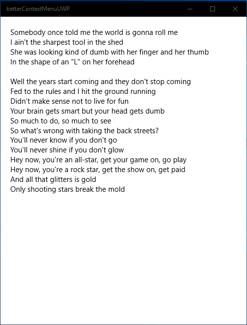

# betterContextMenuUWP
Gives you a more powerful and useful context menu for your UWP Windows 10 app.



## How to install
Available aa Nuget Package. Search for: "betterContextMenu.ColinKiama" or enter this command into Nuget Package Manager: "Install-Package betterContextMenu.ColinKiama"

## How to use this
````csharp
//Inside the SelectionChanged event of a TextBlock
private void myTextBlock_SelectionChanged(object sender, RoutedEventArgs e)
{
  var textblockToUse = (TextBlock)sender;
  contextMenu.setContextMenu(textblockToUse);
}
````
